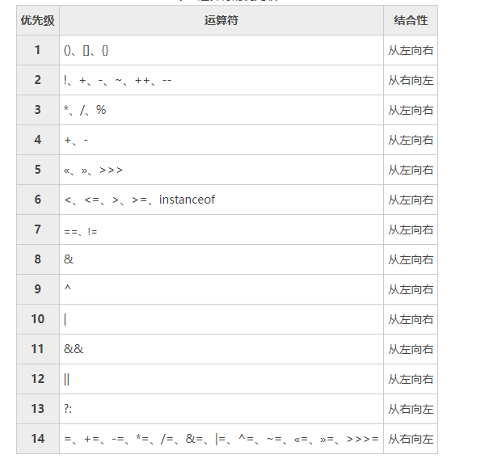
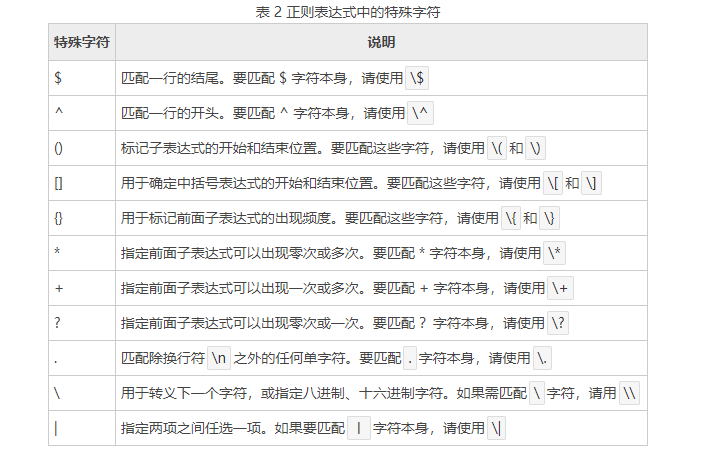
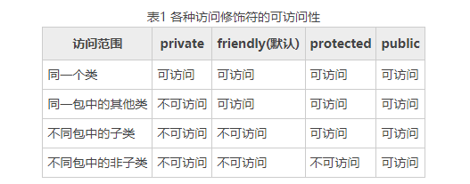

#   java部分
##  了解
    1,jvm,jre,jdk的区别。
        1，jvm：java virtual machine  (java虚拟机，运行java代码)
        2,jre: java runing environment(java运行环境)
        3,jdk : java development kid (java开发包,包含了jre，jvm)
##  基础
    1，标识符和关键字
        常见的有: class public private int void 等
    2，注释
        1，// 2，/**/ 3,/****/
    3,doc注释
        @author,@version,@param
    4,常量
        int a=10.等
    5，静态变量，全局变量，局部变量
        1,静态变量：用static修饰,是被放到静态池中的。其地址在运行期间一直不会改变.
        2,用public修饰的static变量。
        3,形参，方法内，代码块内。
        小知识：成员变量存在于堆内存中和类一起创建。局部变量存在于栈内存中，当方法执行完成，让出内存让其他方法使用.
    6,数据类型
        一个字节=8位
        8个。byte（1）,int（4）,long(8),double(8),char(2),boolean(1),float(4),short(2)。
    7,数据类型转换
        要求：1，两种数据兼容2，目标数据取值范围大于原数据（低类型转高类型）
        隐式转换
        byte->short->int->long->float->double
        char->int
        显示转换（强转）
        (类型)
    8,位运算符(~非,&与,|或,^异或)除了~是单目运算符，其他都是双目。
        规则：
            1，位与运算符为&，其运算规则是：参与运算的数字，低位对齐，高位不足的补零，如果对应的二进制位同时为 1，那么计算结果才为 1，否则为 0。因此，任何数与 0 进行按位与运算，其结果都为 0。
            2，位或运算符为|，其运算规则是：参与运算的数字，低位对齐，高位不足的补零。如果对应的二进制位只要有一个为 1，那么结果就为 1；如果对应的二进制位都为 0，结果才为 0。
            3，位异或运算符为^，其运算规则是：参与运算的数字，低位对齐，高位不足的补零，如果对应的二进制位相同（同时为 0 或同时为 1）时，结果为 0；如果对应的二进制位不相同，结果则为 1。
            4，位取反运算符为~，其运算规则是：只对一个操作数进行运算，将操作数二进制中的 1 改为 0，0 改为 1。
    9，位移运算符(>>,<<)
 
    
    10,复合位赋值运算符

    instanceof(测试左边的对象是否是右边类或者该类的子类创建的实例对象，是，则返回true，否则返回false。)

## 字符串
    1，定义方式
        1，直接定义。2，构造函数
    2，去除字符串中的空格。
        trim()方法
    3,提取子字符串
        subString(int from);
        subString(int from,int end)
    4,分割
        split();
    5,替换
        replace();
        replaceAll();
    6,比较
        equal():
            比较的是字符串中的字符。
        ==:
            比较的是两个对象的引用（地址）
        equalsIgnoreCase() 比较时不区分大小写
        compareTo();
    7，查找
        indexof()
        charAt()
### StringBuffer类
    1，可变的字符串类.
    2，拼接
        append();
    3,替换
        setCharAt();
    4,反转
        reverse();
    5,删除
        deleteCharAt();
        delete();
## String,StringBuffer,StringBuilder的区别
    1,String类是不可变类，一旦一个String对象被创建后在这个对象中的字符序列是不可变的。
    2,StringBuffer和StringBuilder的功能基本相同。但是，StringBuffer是线程安全的，StringBuilder是非线程安全的。
## 正则表达式
    1,在代码中常简写为 regex、regexp 或 RE，它是计算机科学的一个概念。
    2，String 类里也提供了如下几个特殊的方法。
        boolean matches(String regex)：判断该字符串是否匹配指定的正则表达式。
        String replaceAll(String regex, String replacement)：将该字符串中所有匹配 regex 的子串替换成 replacement。
        String replaceFirst(String regex, String replacement)：将该字符串中第一个匹配 regex 的子串替换成 replacement。
        String[] split(String regex)：以 regex 作为分隔符，把该字符串分割成多个子串。

    d 是 digit 的意思，代表数字。
    s 是 space 的意思，代表空白。
    w 是 word 的意思，代表单词。
    d、s、w 的大写形式恰好匹配与之相反的字符。

    Greedy（贪婪模式）：数量表示符默认采用贪婪模式，除非另有表示。贪婪模式的表达式会一直匹配下去，直到无法匹配为止。如果你发现表达式匹配的结果与预期的不符，很有可能是因为你以为表达式只会匹配前面几个字符，而实际上它是贪婪模式，所以会一直匹配下去。
    Reluctant（勉强模式）：用问号后缀（?）表示，它只会匹配最少的字符。也称为最小匹配模式。
    Possessive（占有模式）：用加号后缀（+）表示，目前只有 Java 支持占有模式，通常比较少用。

    3,正则匹配手机号
        String str=""1[3-9][0-9]\\d{8};
##  数字与日期
    1，math类
        提供了常见的数学方法，圆周率pi，常量E
    2，随机数
        Random 类提供了丰富的随机数生成方法，可以产生 boolean、int、long、float、byte 数组以及 double 类型的随机数，这是它与 random() 方法最大的不同之处。random() 方法只能产生 double 类型的 0~1 的随机数。
    3,数字格式化

    4,大数运算
        BigInteger 类是针对整型大数字的处理类，而 BigDecimal 类是针对大小数的处理类。
    5,日期与时间

        1,Calendar 类是一个抽象类，它为特定瞬间与 YEAR、MONTH、DAY_OF—MONTH、HOUR 等日历字段之间的转换提供了一些方法，并为操作日历字段（如获得下星期的日期） 提供了一些方法。

    
        2,DateFormat 是日期/时间格式化子类的抽象类，它以与语言无关的方式格式化并解析日期或时间。日期/时间格式化子类（如 SimpleDateFormat）允许进行格式化（也就是日期→文本）、解析（文本→日期）和标准化日期。

            SHORT：完全为数字，如 12.5.10 或 5:30pm。
            MEDIUM：较长，如 May 10，2016。
            LONG：更长，如 May 12，2016 或 11:15:32am。
            FULL：是完全指定，如 Tuesday、May 10、2012 AD 或 11:l5:42am CST。
        3,如果使用 DateFormat 类格式化日期/时间并不能满足要求，那么就需要使用 DateFormat 类的子类——SimpleDateFormat。

##  Java包装类、装箱和拆箱

    
    1，Object类
        所有类都继承的类包含了基本方法。
##  数组
    1,Arrays工具类
        1）int binarySearch(type[] a, type key)
            使用二分法查询 key 元素值在 a 数组中出现的索引，如果 a 数组不包含 key 元素值，则返回负数。调用该方法时要求数组中元素己经按升序排列，这样才能得到正确结果。
        2）int binarySearch(type[] a, int fromIndex, int toIndex, type key)
            这个方法与前一个方法类似，但它只搜索 a 数组中 fromIndex 到 toIndex 索引的元素。调用该方法时要求数组中元素己经按升序排列，这样才能得到正确结果。
        3）type[] copyOf(type[] original, int length)
            这个方法将会把 original 数组复制成一个新数组，其中 length 是新数组的长度。如果 length 小于 original 数组的长度，则新数组就是原数组的前面 length 个元素，如果 length 大于 original 数组的长度，则新数组的前面元索就是原数组的所有元素，后面补充 0（数值类型）、false（布尔类型）或者 null（引用类型）。
        4）type[] copyOfRange(type[] original, int from, int to)
            这个方法与前面方法相似，但这个方法只复制 original 数组的 from 索引到 to 索引的元素。
        5）boolean equals(type[] a, type[] a2)
            如果 a 数组和 a2 数组的长度相等，而且 a 数组和 a2 数组的数组元素也一一相同，该方法将返回 true。
        6）void fill(type[] a, type val)
            该方法将会把 a 数组的所有元素都赋值为 val。
        7）void fill(type[] a, int fromIndex, int toIndex, type val)
            该方法与前一个方法的作用相同，区别只是该方法仅仅将 a 数组的 fromIndex 到 toIndex 索引的数组元素赋值为 val。
        8）void sort(type[] a)
            该方法对 a 数组的数组元素进行排序。
        9）void sort(type[] a, int fromIndex, int toIndex)
            该方法与前一个方法相似，区别是该方法仅仅对 fromIndex 到 toIndex 索引的元素进行排序。
        10）String toString(type[] a)
            该方法将一个数组转换成一个字符串。该方法按顺序把多个数组元素连缀在一起，多个数组元素使用英文逗号,和空格隔开。

2,排序。（这部分在数据结构中搞）

##  类和对象
    1,定义
        public：表示“共有”的意思。如果使用 public 修饰，则可以被其他类和程序访问。每个 Java 程序的主类都必须是 public 类，作为公共工具供其他类和程序使用的类应定义为 public 类。
        abstract：如果类被 abstract 修饰，则该类为抽象类，抽象类不能被实例化，但抽象类中可以有抽象方法（使用 abstract 修饰的方法）和具体方法（没有使用 abstract 修饰的方法）。继承该抽象类的所有子类都必须实现该抽象类中的所有抽象方法（除非子类也是抽象类）。
        final：如果类被 final 修饰，则不允许被继承。
        class：声明类的关键字。
        class_name：类的名称。
        extends：表示继承其他类。
        implements：表示实现某些接口。
        property_type：表示成员变量的类型。
        property：表示成员变量名称。
        function()：表示成员方法名称
    2,this关键字
        this 关键字是 Java 常用的关键字，可用于任何实例方法内指向当前对象，也可指向对其调用当前方法的对象，或者在需要当前类型对象引用时使用。
    3,访问控制修饰符

    
    4,static
        使用 static 修饰符修饰的属性（成员变量）称为静态变量，也可以称为类变量，常量称为静态常量，方法称为静态方法或类方法，它们统称为静态成员，归整个类所有。
        static 修饰的成员变量和方法，从属于类。
        普通变量和方法从属于对象。
        静态方法不能调用非静态成员，编译会报错。
        类的成员变量可以分为以下两种：
            静态变量（或称为类变量），指被 static 修饰的成员变量。
            实例变量，指没有被 static 修饰的成员变量。
        静态变量与实例变量的区别如下：
        1）静态变量
            运行时，Java 虚拟机只为静态变量分配一次内存，在加载类的过程中完成静态变量的内存分配。
            在类的内部，可以在任何方法内直接访问静态变量。
            在其他类中，可以通过类名访问该类中的静态变量。
        2）实例变量
            每创建一个实例，Java 虚拟机就会为实例变量分配一次内存。
            在类的内部，可以在非静态方法中直接访问实例变量。
            在本类的静态方法或其他类中则需要通过类的实例对象进行访问。
        与成员变量类似，成员方法也可以分为以下两种：
            静态方法（或称为类方法），指被 static 修饰的成员方法。
            实例方法，指没有被 static 修饰的成员方法。
        
        静态方法与实例方法的区别如下：
            静态方法不需要通过它所属的类的任何实例就可以被调用，因此在静态方法中不能使用 this 关键字，也不能直接访问所属类的实例变量和实例方法，但是可以直接访问所属类的静态变量和静态方法。另外，和 this 关键字一样，super 关键字也与类的特定实例相关，所以在静态方法中也不能使用 super 关键字。
            在实例方法中可以直接访问所属类的静态变量、静态方法、实例变量和实例方法。
    5,final
        final 在 Java 中的意思是最终，也可以称为完结器，表示对象是最终形态的，不可改变的意思。final 应用于类、方法和变量时意义是不同的，但本质是一样的，都表示不可改变，类似 C# 里的 sealed 关键字。
        使用 final 关键字声明类、变量和方法需要注意以下几点：
            final 用在变量的前面表示变量的值不可以改变，此时该变量可以被称为常量。
            final 用在方法的前面表示方法不可以被重写（子类中如果创建了一个与父类中相同名称、相同返回值类型、相同参数列表的方法，只是方法体中的实现不同，以实现不同于父类的功能，这种方式被称为方法重写，又称为方法覆盖。这里了解即可，教程后面我们会详细讲解）。
            final 用在类的前面表示该类不能有子类，即该类不可以被继承。
    6,构造
        构造方法是类的一种特殊方法，用来初始化类的一个新的对象，在创建对象（new 运算符）之后自动调用。Java 中的每个类都有一个默认的构造方法，并且可以有一个以上的构造方法。
        Java 构造方法有以下特点：
            方法名必须与类名相同
            可以有 0 个、1 个或多个参数
            没有任何返回值，包括 void
            默认返回类型就是对象类型本身
            只能与 new 运算符结合使用

递归在数据结构中研究

## 继承与多态