#   java部分
##  了解
    1,jvm,jre,jdk的区别。
        1，jvm：java virtual machine  (java虚拟机，运行java代码)
        2,jre: java runing environment(java运行环境)
        3,jdk : java development kid (java开发包,包含了jre，jvm)
##  基础
    1，标识符和关键字
        常见的有: class public private int void 等
    2，注释
        1，// 2，/**/ 3,/****/
    3,doc注释
        @author,@version,@param
    4,常量
        int a=10.等
    5，静态变量，全局变量，局部变量
        1,静态变量：用static修饰,是被放到静态池中的。其地址在运行期间一直不会改变.
        2,用public修饰的static变量。
        3,形参，方法内，代码块内。
        小知识：成员变量存在于堆内存中和类一起创建。局部变量存在于栈内存中，当方法执行完成，让出内存让其他方法使用.
    6,数据类型
        一个字节=8位
        8个。byte（1）,int（4）,long(8),double(8),char(2),boolean(1),float(4),short(2)。
    7,数据类型转换
        要求：1，两种数据兼容2，目标数据取值范围大于原数据（低类型转高类型）
        隐式转换
        byte->short->int->long->float->double
        char->int
        显示转换（强转）
        (类型)
    8,位运算符(~非,&与,|或,^异或)除了~是单目运算符，其他都是双目。
        规则：
            1，位与运算符为&，其运算规则是：参与运算的数字，低位对齐，高位不足的补零，如果对应的二进制位同时为 1，那么计算结果才为 1，否则为 0。因此，任何数与 0 进行按位与运算，其结果都为 0。
            2，位或运算符为|，其运算规则是：参与运算的数字，低位对齐，高位不足的补零。如果对应的二进制位只要有一个为 1，那么结果就为 1；如果对应的二进制位都为 0，结果才为 0。
            3，位异或运算符为^，其运算规则是：参与运算的数字，低位对齐，高位不足的补零，如果对应的二进制位相同（同时为 0 或同时为 1）时，结果为 0；如果对应的二进制位不相同，结果则为 1。
            4，位取反运算符为~，其运算规则是：只对一个操作数进行运算，将操作数二进制中的 1 改为 0，0 改为 1。
    9，位移运算符(>>,<<)
<br>
    
    10,复合位赋值运算符


    instanceof(测试左边的对象是否是右边类或者该类的子类创建的实例对象，是，则返回true，否则返回false。)

## 字符串
    1，定义方式
        1，直接定义。2，构造函数
    2，去除字符串中的空格。
        trim()方法
    3,提取子字符串
        subString(int from);
        subString(int from,int end)
    4,分割
        split();
    5,替换
        replace();
        replaceAll();
    6,比较
        equal():
            比较的是字符串中的字符。
        ==:
            比较的是两个对象的引用（地址）
        equalsIgnoreCase() 比较时不区分大小写
        compareTo();
    7，查找
        indexof()
        charAt()
### StringBuffer类
    1，可变的字符串类.
    2，拼接
        append();
    3,替换
        setCharAt();
    4,反转
        reverse();
    5,删除
        deleteCharAt();
        delete();
## String,StringBuffer,StringBuilder的区别
    1,String类是不可变类，一旦一个String对象被创建后在这个对象中的字符序列是不可变的。
    2,StringBuffer和StringBuilder的功能基本相同。但是，StringBuffer是线程安全的，StringBuilder是非线程安全的。
## 正则表达式
    1,在代码中常简写为 regex、regexp 或 RE，它是计算机科学的一个概念。
    2，String 类里也提供了如下几个特殊的方法。
        boolean matches(String regex)：判断该字符串是否匹配指定的正则表达式。
        String replaceAll(String regex, String replacement)：将该字符串中所有匹配 regex 的子串替换成 replacement。
        String replaceFirst(String regex, String replacement)：将该字符串中第一个匹配 regex 的子串替换成 replacement。
        String[] split(String regex)：以 regex 作为分隔符，把该字符串分割成多个子串。
 


    d 是 digit 的意思，代表数字。
    s 是 space 的意思，代表空白。
    w 是 word 的意思，代表单词。
    d、s、w 的大写形式恰好匹配与之相反的字符。

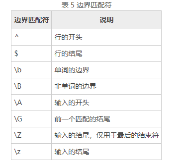

    Greedy（贪婪模式）：数量表示符默认采用贪婪模式，除非另有表示。贪婪模式的表达式会一直匹配下去，直到无法匹配为止。如果你发现表达式匹配的结果与预期的不符，很有可能是因为你以为表达式只会匹配前面几个字符，而实际上它是贪婪模式，所以会一直匹配下去。
    Reluctant（勉强模式）：用问号后缀（?）表示，它只会匹配最少的字符。也称为最小匹配模式。
    Possessive（占有模式）：用加号后缀（+）表示，目前只有 Java 支持占有模式，通常比较少用。


    3,正则匹配手机号
        String str=""1[3-9][0-9]\\d{8};
##  数字与日期
    1，math类
        提供了常见的数学方法，圆周率pi，常量E
    2，随机数
        Random 类提供了丰富的随机数生成方法，可以产生 boolean、int、long、float、byte 数组以及 double 类型的随机数，这是它与 random() 方法最大的不同之处。random() 方法只能产生 double 类型的 0~1 的随机数。
    3,数字格式化


    4,大数运算
        BigInteger 类是针对整型大数字的处理类，而 BigDecimal 类是针对大小数的处理类。
    5,日期与时间
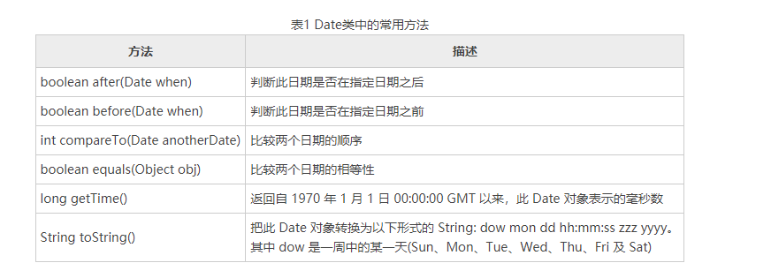

        1,Calendar 类是一个抽象类，它为特定瞬间与 YEAR、MONTH、DAY_OF—MONTH、HOUR 等日历字段之间的转换提供了一些方法，并为操作日历字段（如获得下星期的日期） 提供了一些方法。
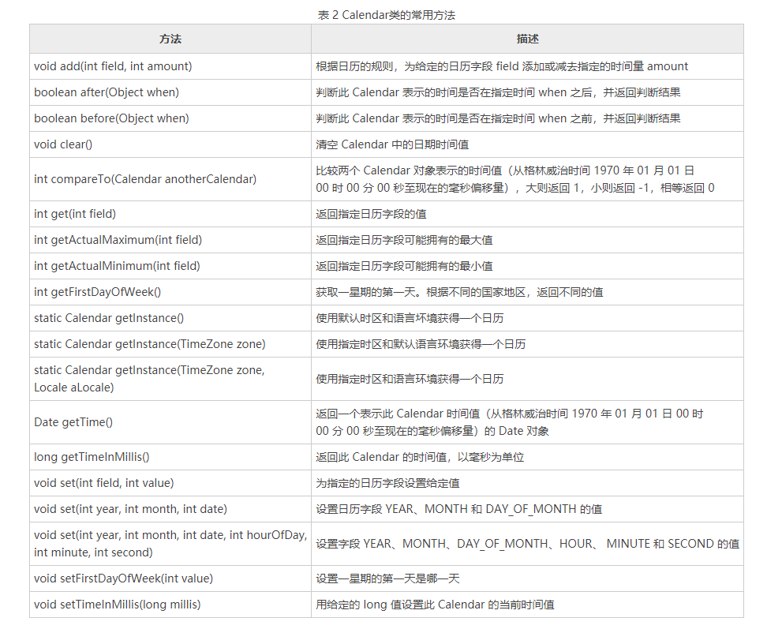
    
        2,DateFormat 是日期/时间格式化子类的抽象类，它以与语言无关的方式格式化并解析日期或时间。日期/时间格式化子类（如 SimpleDateFormat）允许进行格式化（也就是日期→文本）、解析（文本→日期）和标准化日期。


            SHORT：完全为数字，如 12.5.10 或 5:30pm。
            MEDIUM：较长，如 May 10，2016。
            LONG：更长，如 May 12，2016 或 11:15:32am。
            FULL：是完全指定，如 Tuesday、May 10、2012 AD 或 11:l5:42am CST。
        3,如果使用 DateFormat 类格式化日期/时间并不能满足要求，那么就需要使用 DateFormat 类的子类——SimpleDateFormat。


##  Java包装类、装箱和拆箱

    
    1，Object类
        所有类都继承的类包含了基本方法。
##  数组
    1,Arrays工具类
        1）int binarySearch(type[] a, type key)
            使用二分法查询 key 元素值在 a 数组中出现的索引，如果 a 数组不包含 key 元素值，则返回负数。调用该方法时要求数组中元素己经按升序排列，这样才能得到正确结果。
        2）int binarySearch(type[] a, int fromIndex, int toIndex, type key)
            这个方法与前一个方法类似，但它只搜索 a 数组中 fromIndex 到 toIndex 索引的元素。调用该方法时要求数组中元素己经按升序排列，这样才能得到正确结果。
        3）type[] copyOf(type[] original, int length)
            这个方法将会把 original 数组复制成一个新数组，其中 length 是新数组的长度。如果 length 小于 original 数组的长度，则新数组就是原数组的前面 length 个元素，如果 length 大于 original 数组的长度，则新数组的前面元索就是原数组的所有元素，后面补充 0（数值类型）、false（布尔类型）或者 null（引用类型）。
        4）type[] copyOfRange(type[] original, int from, int to)
            这个方法与前面方法相似，但这个方法只复制 original 数组的 from 索引到 to 索引的元素。
        5）boolean equals(type[] a, type[] a2)
            如果 a 数组和 a2 数组的长度相等，而且 a 数组和 a2 数组的数组元素也一一相同，该方法将返回 true。
        6）void fill(type[] a, type val)
            该方法将会把 a 数组的所有元素都赋值为 val。
        7）void fill(type[] a, int fromIndex, int toIndex, type val)
            该方法与前一个方法的作用相同，区别只是该方法仅仅将 a 数组的 fromIndex 到 toIndex 索引的数组元素赋值为 val。
        8）void sort(type[] a)
            该方法对 a 数组的数组元素进行排序。
        9）void sort(type[] a, int fromIndex, int toIndex)
            该方法与前一个方法相似，区别是该方法仅仅对 fromIndex 到 toIndex 索引的元素进行排序。
        10）String toString(type[] a)
            该方法将一个数组转换成一个字符串。该方法按顺序把多个数组元素连缀在一起，多个数组元素使用英文逗号,和空格隔开。
<p style="color: red">2,排序。（这部分在数据结构中搞）</p>

##  类和对象
    1,定义
        public：表示“共有”的意思。如果使用 public 修饰，则可以被其他类和程序访问。每个 Java 程序的主类都必须是 public 类，作为公共工具供其他类和程序使用的类应定义为 public 类。
        abstract：如果类被 abstract 修饰，则该类为抽象类，抽象类不能被实例化，但抽象类中可以有抽象方法（使用 abstract 修饰的方法）和具体方法（没有使用 abstract 修饰的方法）。继承该抽象类的所有子类都必须实现该抽象类中的所有抽象方法（除非子类也是抽象类）。
        final：如果类被 final 修饰，则不允许被继承。
        class：声明类的关键字。
        class_name：类的名称。
        extends：表示继承其他类。
        implements：表示实现某些接口。
        property_type：表示成员变量的类型。
        property：表示成员变量名称。
        function()：表示成员方法名称
    2,this关键字
        this 关键字是 Java 常用的关键字，可用于任何实例方法内指向当前对象，也可指向对其调用当前方法的对象，或者在需要当前类型对象引用时使用。
    3,访问控制修饰符

    
    4,static
        使用 static 修饰符修饰的属性（成员变量）称为静态变量，也可以称为类变量，常量称为静态常量，方法称为静态方法或类方法，它们统称为静态成员，归整个类所有。
        static 修饰的成员变量和方法，从属于类。
        普通变量和方法从属于对象。
        静态方法不能调用非静态成员，编译会报错。
        类的成员变量可以分为以下两种：
            静态变量（或称为类变量），指被 static 修饰的成员变量。
            实例变量，指没有被 static 修饰的成员变量。
        静态变量与实例变量的区别如下：
        1）静态变量
            运行时，Java 虚拟机只为静态变量分配一次内存，在加载类的过程中完成静态变量的内存分配。
            在类的内部，可以在任何方法内直接访问静态变量。
            在其他类中，可以通过类名访问该类中的静态变量。
        2）实例变量
            每创建一个实例，Java 虚拟机就会为实例变量分配一次内存。
            在类的内部，可以在非静态方法中直接访问实例变量。
            在本类的静态方法或其他类中则需要通过类的实例对象进行访问。
        与成员变量类似，成员方法也可以分为以下两种：
            静态方法（或称为类方法），指被 static 修饰的成员方法。
            实例方法，指没有被 static 修饰的成员方法。
        
        静态方法与实例方法的区别如下：
            静态方法不需要通过它所属的类的任何实例就可以被调用，因此在静态方法中不能使用 this 关键字，也不能直接访问所属类的实例变量和实例方法，但是可以直接访问所属类的静态变量和静态方法。另外，和 this 关键字一样，super 关键字也与类的特定实例相关，所以在静态方法中也不能使用 super 关键字。
            在实例方法中可以直接访问所属类的静态变量、静态方法、实例变量和实例方法。
    5,final
        final 在 Java 中的意思是最终，也可以称为完结器，表示对象是最终形态的，不可改变的意思。final 应用于类、方法和变量时意义是不同的，但本质是一样的，都表示不可改变，类似 C# 里的 sealed 关键字。
        使用 final 关键字声明类、变量和方法需要注意以下几点：
            final 用在变量的前面表示变量的值不可以改变，此时该变量可以被称为常量。
            final 用在方法的前面表示方法不可以被重写（子类中如果创建了一个与父类中相同名称、相同返回值类型、相同参数列表的方法，只是方法体中的实现不同，以实现不同于父类的功能，这种方式被称为方法重写，又称为方法覆盖。这里了解即可，教程后面我们会详细讲解）。
            final 用在类的前面表示该类不能有子类，即该类不可以被继承。
    6,构造
        构造方法是类的一种特殊方法，用来初始化类的一个新的对象，在创建对象（new 运算符）之后自动调用。Java 中的每个类都有一个默认的构造方法，并且可以有一个以上的构造方法。
        Java 构造方法有以下特点：
            方法名必须与类名相同
            可以有 0 个、1 个或多个参数
            没有任何返回值，包括 void
            默认返回类型就是对象类型本身
            只能与 new 运算符结合使用
<p style="color: red">递归在数据结构中研究</p>

## 继承与多态
    1，类的封装
        面向对象的三大特性之一。封装将类的某些信息隐藏在类内部，不允许外部程序直接访问，只能通过该类提供的方法来实现对隐藏信息的操作和访问。
    2，继承
        之面向对象的三大特性一。继承就是在已经存在类的基础上进行扩展，从而产生新的类。已经存在的类称为父类、基类或超类，而新产生的类称为子类或派生类。在子类中，不仅包含父类的属性和方法，还可以增加新的属性和方法。
        Java 不支持多继承，只允许一个类直接继承另一个类，即子类只能有一个直接父类，extends 关键字后面只能有一个类名。
        继承的优缺点
            在面向对象语言中，继承是必不可少的、非常优秀的语言机制，它有如下优点：
            实现代码共享，减少创建类的工作量，使子类可以拥有父类的方法和属性。
            提高代码维护性和可重用性。
            提高代码的可扩展性，更好的实现父类的方法。
        继承的缺点如下：
            继承是侵入性的。只要继承，就必须拥有父类的属性和方法。
            降低代码灵活性。子类拥有父类的属性和方法后多了些约束。
            增强代码耦合性（开发项目的原则为高内聚低耦合）。当父类的常量、变量和方法被修改时，需要考虑子类的修改，有可能会导致大段的代码需要重构。
    3，super
        子类不能继承父类的构造方法，因此，如果要调用父类的构造方法，可以使用 super 关键字。super 可以用来访问父类的构造方法、普通方法和属性。
        super 关键字的功能：
            在子类的构造方法中显式的调用父类构造方法
            访问父类的成员方法和变量。
        如果一个类中没有写任何的构造方法，JVM 会生成一个默认的无参构造方法。在继承关系中，由于在子类的构造方法中，第一条语句默认为调用父类的无参构造方法（即默认为 super()，一般这行代码省略了）。所以当在父类中定义了有参构造方法，但是没有定义无参构造方法时，编译器会强制要求我们定义一个相同参数类型的构造方法。
    4,对象类型转换
        将一个类型强制转换成另一个类型的过程被称为类型转换。本节所说的对象类型转换，是指存在继承关系的对象，不是任意类型的对象。当对不存在继承关系的对象进行强制类型转换时，会抛出 Java 强制类型转换（java.lang.ClassCastException）异常。
        Java 语言允许某个类型的引用变量引用子类的实例，而且可以对这个引用变量进行类型转换。Java 中引用类型之间的类型转换（前提是两个类是父子关系）主要有两种，分别是向上转型（upcasting）和向下转型（downcasting）。
        1）向上转型
            父类引用指向子类对象为向上转型
        2）向下转型
            与向上转型相反，子类对象指向父类引用为向下转型
    5,重载
        如果同一个类中包含了两个或两个以上方法名相同的方法，但形参列表不同，这种情况被称为方法重载（overload）;
    6,重写
        在子类中如果创建了一个与父类中相同名称、相同返回值类型、相同参数列表的方法，只是方法体中的实现不同，以实现不同于父类的功能，这种方式被称为方法重写（override），又称为方法覆盖。当父类中的方法无法满足子类需求或子类具有特有功能的时候，需要方法重写。
        在重写方法时，需要遵循下面的规则：
            参数列表必须完全与被重写的方法参数列表相同。
            返回的类型必须与被重写的方法的返回类型相同（Java1.5 版本之前返回值类型必须一样，之后的 Java 版本放宽了限制，返回值类型必须小于或者等于父类方法的返回值类型）。
            访问权限不能比父类中被重写方法的访问权限更低（public>protected>default>private）。
            重写方法一定不能抛出新的检査异常或者比被重写方法声明更加宽泛的检査型异常。例如，父类的一个方法声明了一个检査异常 IOException，在重写这个方法时就不能抛出 Exception，只能拋出 IOException 的子类异常，可以抛出非检査异常。
            重写的方法可以使用 @Override 注解来标识。
            父类的成员方法只能被它的子类重写。
            声明为 final 的方法不能被重写。
            声明为 static 的方法不能被重写，但是能够再次声明。
            构造方法不能被重写。
            子类和父类在同一个包中时，子类可以重写父类的所有方法，除了声明为 private 和 final 的方法。
            子类和父类不在同一个包中时，子类只能重写父类的声明为 public 和 protected 的非 final 方法。
            如果不能继承一个方法，则不能重写这个方法。
    7,多态
        之面向对象的三大特性一。
        多态性是面向对象编程的又一个重要特征，它是指在父类中定义的属性和方法被子类继承之后，可以具有不同的数据类型或表现出不同的行为，这使得同一个属性或方法在父类及其各个子类中具有不同的含义。
        对面向对象来说，多态分为编译时多态和运行时多态。其中编译时多态是静态的，主要是指方法的重载，它是根据参数列表的不同来区分不同的方法。通过编译之后会变成两个不同的方法，在运行时谈不上多态。而运行时多态是动态的，它是通过动态绑定来实现的，也就是大家通常所说的多态性。
        Java 实现多态有 3 个必要条件：继承、重写和向上转型。只有满足这 3 个条件，开发人员才能够在同一个继承结构中使用统一的逻辑实现代码处理不同的对象，从而执行不同的行为。
        继承：在多态中必须存在有继承关系的子类和父类。
        重写：子类对父类中某些方法进行重新定义，在调用这些方法时就会调用子类的方法。
        向上转型：在多态中需要将子类的引用赋给父类对象，只有这样该引用才既能可以调用父类的方法，又能调用子类的方法。
    8，抽象类
        用abstract修饰的类。
        如果一个方法使用 abstract 来修饰，则说明该方法是抽象方法，抽象方法只有声明没有实现。需要注意的是 abstract 关键字只能用于普通方法，不能用于 static 方法或者构造方法中。
        抽象方法的 3 个特征如下：
            抽象方法没有方法体
            抽象方法必须存在于抽象类中
            子类重写父类时，必须重写父类所有的抽象方法
        注意：在使用 abstract 关键字修饰抽象方法时不能使用 private 修饰，因为抽象方法必须被子类重写，而如果使用了 private 声明，则子类是无法重写的。
        抽象类的定义和使用规则如下：
            抽象类和抽象方法都要使用 abstract 关键字声明。
            如果一个方法被声明为抽象的，那么这个类也必须声明为抽象的。而一个抽象类中，可以有 0~n 个抽象方法，以及 0~n 个具体方法。
            抽象类不能实例化，也就是不能使用 new 关键字创建对象。
    9，接口
        用interface修饰的类。
    10，java8特性——lambda表达式
        Lambda 表达式（Lambda expression）是一个匿名函数，基于数学中的λ演算得名，也可称为闭包（Closure）。把函数作为一个方法的参数（函数作为参数传递进方法中）
##  异常
    1,在 Java 中一个异常的产生，主要有如下三种原因：
        Java 内部错误发生异常，Java 虚拟机产生的异常。
        编写的程序代码中的错误所产生的异常，例如空指针异常、数组越界异常等。
        通过 throw 语句手动生成的异常，一般用来告知该方法的调用者一些必要信息。
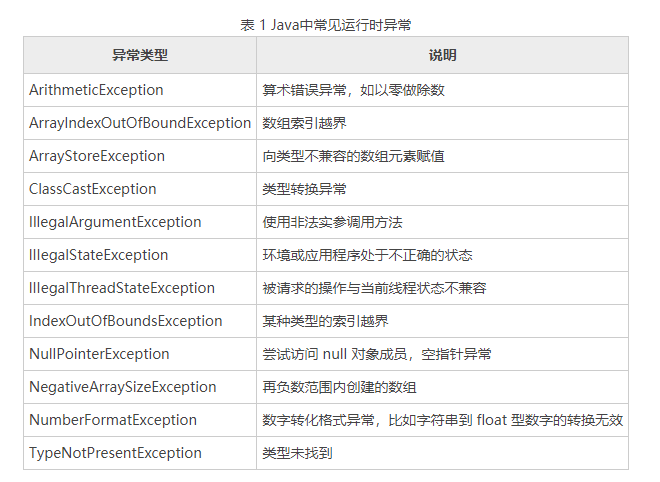

    
    2,Error和Exception的异同
        Exception 是程序正常运行过程中可以预料到的意外情况，并且应该被开发者捕获，进行相应的处理。Error 是指正常情况下不大可能出现的情况，绝大部分的 Error 都会导致程序处于非正常、不可恢复状态。所以不需要被开发者捕获。
        常见的 Error 和 Exception：
            1）运行时异常（RuntimeException）：
            NullPropagation：空指针异常；
            ClassCastException：类型强制转换异常
            IllegalArgumentException：传递非法参数异常
            IndexOutOfBoundsException：下标越界异常
            NumberFormatException：数字格式异常
            
            2）非运行时异常：
            ClassNotFoundException：找不到指定 class 的异常
            IOException：IO 操作异常
            
            3）错误（Error）：
            NoClassDefFoundError：找不到 class 定义异常
            StackOverflowError：深递归导致栈被耗尽而抛出的异常
            OutOfMemoryError：内存溢出异常
    3,异常处理机制
        异常处理通过 5 个关键字来实现：try、catch、throw、throws 和 finally。try catch 语句用于捕获并处理异常，finally 语句用于在任何情况下（除特殊情况外）都必须执行的代码，throw 语句用于拋出异常，throws 语句用于声明可能会出现的异常。
```java
    public  class demo{
        public static void main(String[] args) {
            try {
                //逻辑程序块
            } catch(ExceptionType1 e) {
                //处理代码块1
            } catch (ExceptionType2 e) {
                //处理代码块2
                throw(e);    // 再抛出这个"异常"
            } finally {
               // 释放资源代码块
            }
        }
        
    }
```
    如果 try 语句块中发生异常，那么一个相应的异常对象就会被拋出，然后 catch 语句就会依据所拋出异常对象的类型进行捕获，并处理。处理之后，程序会跳过 try 语句块中剩余的语句，转到 catch 语句块后面的第一条语句开始执行。
    4,语句
        使用 try-catch-finally 语句时需注意以下几点：
            异常处理语法结构中只有 try 块是必需的，也就是说，如果没有 try 块，则不能有后面的 catch 块和 finally 块；
            catch 块和 finally 块都是可选的，但 catch 块和 finally 块至少出现其中之一，也可以同时出现；
            可以有多个 catch 块，捕获父类异常的 catch 块必须位于捕获子类异常的后面；
            不能只有 try 块，既没有 catch 块，也没有 finally 块；
            多个 catch 块必须位于 try 块之后，finally 块必须位于所有的 catch 块之后。
            finally 与 try 语句块匹配的语法格式，此种情况会导致异常丢失，所以不常见。
        try catch finally 语句块的执行情况可以细分为以下 3 种情况：
            如果 try 代码块中没有拋出异常，则执行完 try 代码块之后直接执行 finally 代码块，然后执行 try catch finally 语句块之后的语句。
            如果 try 代码块中拋出异常，并被 catch 子句捕捉，那么在拋出异常的地方终止 try 代码块的执行，转而执行相匹配的 catch 代码块，之后执行 finally 代码块。如果 finally 代码块中没有拋出异常，则继续执行 try catch finally 语句块之后的语句；如果 finally 代码块中拋出异常，则把该异常传递给该方法的调用者。
            如果 try 代码块中拋出的异常没有被任何 catch 子句捕捉到，那么将直接执行 finally 代码块中的语句，并把该异常传递给该方法的调用者。
    5,throws声明异常
        使用 throws 声明抛出异常时有一个限制，是方法重写中的一条规则：子类方法声明抛出的异常类型应该是父类方法声明抛出的异常类型的子类或相同，子类方法声明抛出的异常不允许比父类方法声明抛出的异常多。
    6,throw 抛出异常
        与 throws 不同的是，throw 语句用来直接拋出一个异常，后接一个可拋出的异常类对象
## 集合，泛型和枚举
    1,集合
        集合类主要负责保存、盛装其他数据，因此集合类也被称为容器类。
        Java 集合类型分为 Collection 和 Map，它们是 Java 集合的根接口，这两个接口又包含了一些子接口或实现类。


    2,collection

    
    3,List
        List 是一个有序、可重复的集合，集合中每个元素都有其对应的顺序索引。List 集合允许使用重复元素，可以通过索引来访问指定位置的集合元素。List 集合默认按元素的添加顺序设置元素的索引，第一个添加到 List 集合中的元素的索引为 0，第二个为 1，依此类推。
        List 实现了 Collection 接口，它主要有两个常用的实现类：ArrayList 类和 LinkedList 类。
        ArrayList类实现了可变数组的大小，存储在内的数据称为元素。它还提供了快速基于索引访问元素的方式，对尾部成员的增加和删除支持较好。使用 ArrayList 创建的集合，允许对集合中的元素进行快速的随机访问，不过，向 ArrayList 中插入与删除元素的速度相对较慢。
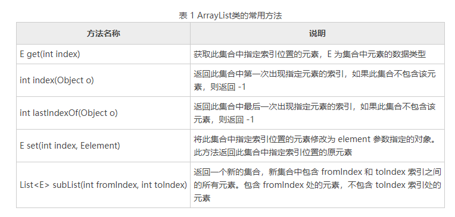

        当调用 List 的 set(int index, Object element) 方法来改变 List 集合指定索引处的元素时，指定的索引必须是 List 集合的有效索引。例如集合长度为 4，就不能指定替换索引为 4 处的元素，也就是说这个方法不会改变 List 集合的长度。
    4,set
        Set 集合类似于一个罐子，程序可以依次把多个对象“丢进”Set 集合，而 Set 集合通常不能记住元素的添加顺序。也就是说 Set 集合中的对象不按特定的方式排序，只是简单地把对象加入集合。Set 集合中不能包含重复的对象，并且最多只允许包含一个 null 元素。
        Set 实现了 Collection 接口，它主要有两个常用的实现类：HashSet 类和 TreeSet类。
        hashset
            HashSet 是 Set 接口的典型实现，大多数时候使用 Set 集合时就是使用这个实现类。HashSet 是按照 Hash 算法来存储集合中的元素。因此具有很好的存取和查找性能。
            HashSet 具有以下特点：
                不能保证元素的排列顺序，顺序可能与添加顺序不同，顺序也有可能发生变化。
                HashSet 不是同步的，如果多个线程同时访问或修改一个 HashSet，则必须通过代码来保证其同步。
                集合元素值可以是 null。
        treeset
        TreeSet 类同时实现了 Set 接口和 SortedSet 接口。SortedSet 接口是 Set 接口的子接口，可以实现对集合进行自然排序，因此使用 TreeSet 类实现的 Set 接口默认情况下是自然排序的，这里的自然排序指的是升序排序。
        TreeSet 只能对实现了 Comparable 接口的类对象进行排序，因为 Comparable 接口中有一个 compareTo(Object o) 方法用于比较两个对象的大小。例如 a.compareTo(b)，如果 a 和 b 相等，则该方法返回 0；如果 a 大于 b，则该方法返回大于 0 的值；如果 a 小于 b，则该方法返回小于 0 的值。


    5，map

        Map 接口主要有两个实现类：HashMap 类和 TreeMap 类。其中，HashMap 类按哈希算法来存取键对象，而 TreeMap 类可以对键对象进行排序。
        TreeMap 类的使用方法与 HashMap 类相同，唯一不同的是 TreeMap 类可以对键对象进行排序。
        Map的遍历:
```java
    public class demo{
        //在 for 循环中使用 entries 实现 Map 的遍历
        public static void main(String[] args) {
            Map<String, String> map = new HashMap<String, String>();
            map.put("1", "1");
            map.put("2", "2");
            for (Map.Entry<String, String> entry : map.entrySet()) {
                String mapKey = entry.getKey();
                String mapValue = entry.getValue();
                System.out.println(mapKey + "：" + mapValue);
            }
        }
        //使用 for-each 循环遍历 key 或者 values，一般适用于只需要 Map 中的 key 或者 value 时使用。性能上比 entrySet 较好。
        public void demo2(){
            Map<String, String> map = new HashMap<String, String>();
            map.put("1", "1");
            map.put("2", "2");
            // 打印键集合
            for (String key : map.keySet()) {
                System.out.println(key);
            }
            // 打印值集合
            for (String value : map.values()) {
                System.out.println(value);
            }
        }
        
        //使用迭代器（Iterator）遍历
        public void demo3(){
            Map<String, String> map = new HashMap<String, String>();
            map.put("1", "1");
            map.put("2", "2");
            Iterator<Entry<String, String>> entries = map.entrySet().iterator();
            while (entries.hasNext()) {
                Entry<String, String> entry = entries.next();
                String key = entry.getKey();
                String value = entry.getValue();
                System.out.println(key + ":" + value);
            }
        }
        
        //通过键找值遍历，这种方式的效率比较低，因为本身从键取值是耗时的操作。
        public void demo4(){
            for(String key : map.keySet()){
                String value = map.get(key);
                System.out.println(key+":"+value);
            }
        }
    }
```
    6,Lambda表达式遍历Collection集合
```java
    public class CollectionEach {
        public static void main(String[] args) {
            // 创建一个集合
            Collection objs = new HashSet();
            objs.add("1");
            objs.add("2");
            objs.add("3");
            // 调用forEach()方法遍历集合
            objs.forEach(obj->{int a = 1;});
            objs.forEach(obj -> System.out.println("迭代集合元素：" + obj));
        }
    }
```

## 枚举
    1,声明枚举时必须使用 enum 关键字
    2,EnumMap 和 EnumSet两个方法
## 反射
    1,编译期是指把源码交给编译器编译成计算机可以执行的文件的过程。在 Java 中也就是把 Java 代码编成 class 文件的过程。编译期只是做了一些翻译功能，并没有把代码放在内存中运行起来，而只是把代码当成文本进行操作，比如检查错误。
    2,运行期是把编译后的文件交给计算机执行，直到程序运行结束。所谓运行期就把在磁盘中的代码放到内存中执行起来。
    3,Java 反射机制是在运行状态中，对于任意一个类，都能够知道这个类的所有属性和方法；对于任意一个对象，都能够调用它的任意方法和属性；这种动态获取信息以及动态调用对象方法的功能称为 Java 语言的反射机制。简单来说，反射机制指的是程序在运行时能够获取自身的信息。在 Java 中，只要给定类的名字，就可以通过反射机制来获得类的所有信息。
    4,在 ORM 中间件的实现中，运用 Java 反射机制可以读取任意一个 JavaBean 的所有属性，或者给这些属性赋值。
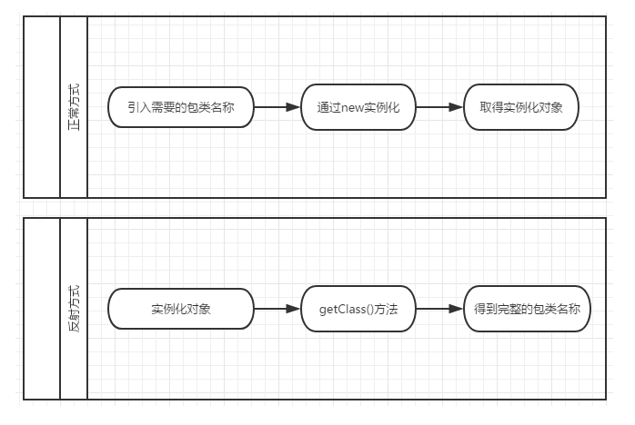
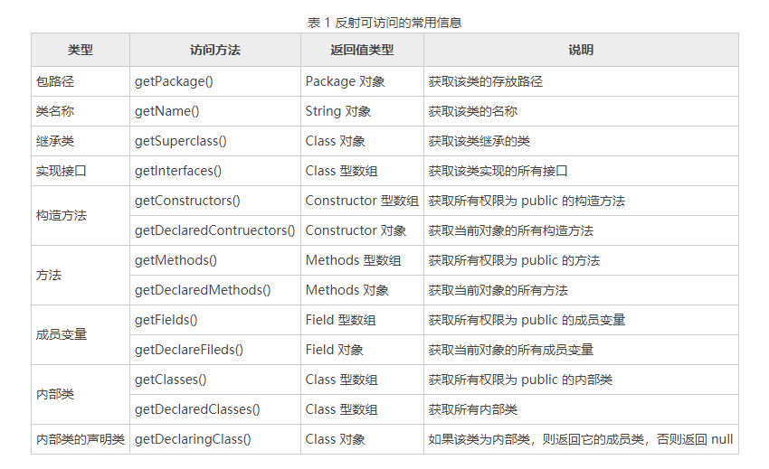

    Java 反射机制的优缺点
    优点：
        能够运行时动态获取类的实例，大大提高系统的灵活性和扩展性。
        与 Java 动态编译相结合，可以实现无比强大的功能。
        对于 Java 这种先编译再运行的语言，能够让我们很方便的创建灵活的代码，这些代码可以在运行时装配，无需在组件之间进行源代码的链接，更加容易实现面向对象。
    缺点：
        反射会消耗一定的系统资源，因此，如果不需要动态地创建一个对象，那么就不需要用反射；
        反射调用方法时可以忽略权限检查，获取这个类的私有方法和属性，因此可能会破坏类的封装性而导致安全问题。

## 输入输出流
    1,数据流是 Java 进行 I/O 操作的对象，它按照不同的标准可以分为不同的类别。
        按照流的方向主要分为输入流和输出流两大类。
        数据流按照数据单位的不同分为字节流和字符流。
        按照功能可以划分为节点流和处理流。
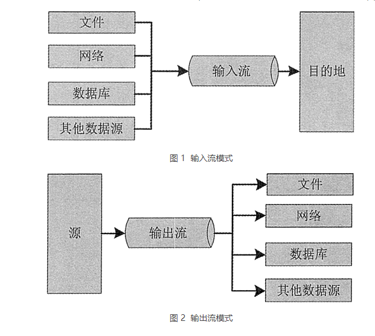
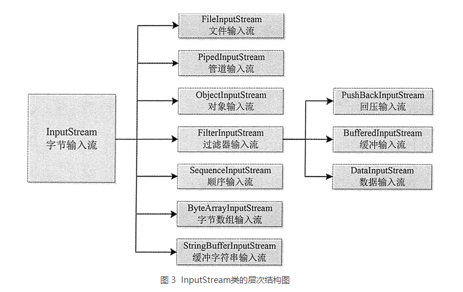

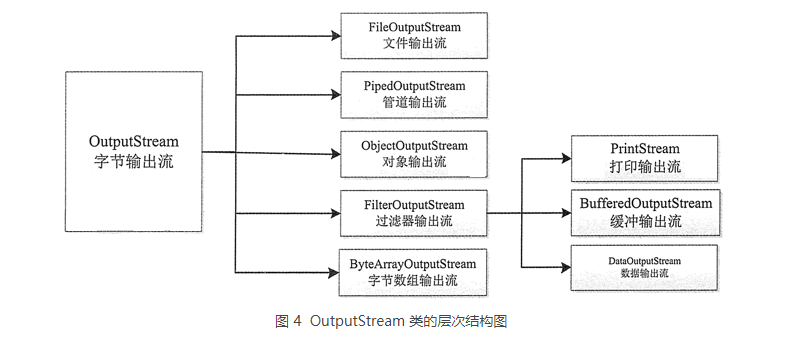
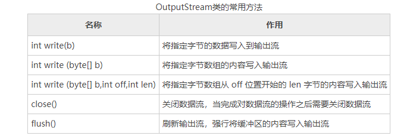

    2,编码
        Java 中常见编码说明如下：
            ISO8859-1：属于单字节编码，最多只能表示 0~255 的字符范围。
            GBK/GB2312：中文的国标编码，用来表示汉字，属于双字节编码。GBK 可以表示简体中文和繁体中文，而 GB2312 只能表示简体中文。GBK 兼容 GB2312。
            Unicode：是一种编码规范，是为解决全球字符通用编码而设计的。UTF-8 和 UTF-16 是这种规范的一种实现，此编码不兼容 ISO8859-1 编码。Java 内部采用此编码。
            UTF：UTF 编码兼容了 ISO8859-1 编码，同时也可以用来表示所有的语言字符，不过 UTF 编码是不定长编码，每一个字符的长度为 1~6 个字节不等。一般在中文网页中使用此编码，可以节省空间。
    3,File类
        File 类提供了如下三种形式构造方法。
            File(String path)：如果 path 是实际存在的路径，则该 File 对象表示的是目录；如果 path 是文件名，则该 File 对象表示的是文件。
            File(String path, String name)：path 是路径名，name 是文件名。
            File(File dir, String name)：dir 是路径对象，name 是文件名。


    4,字节流
        1,输入流
            InputStream 类及其子类的对象表示字节输入流，InputStream 类的常用子类如下。
                ByteArrayInputStream 类：将字节数组转换为字节输入流，从中读取字节。
                FileInputStream 类：从文件中读取数据。
                PipedInputStream 类：连接到一个 PipedOutputStream（管道输出流）。
                SequenceInputStream 类：将多个字节输入流串联成一个字节输入流。
                ObjectInputStream 类：将对象反序列化。
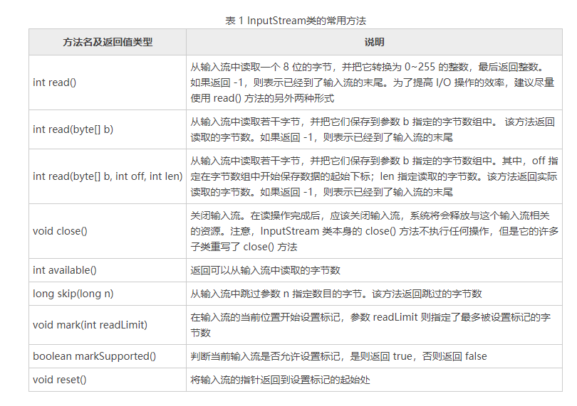
        
        2,输出流
            OutputStream 类及其子类的对象表示一个字节输出流。OutputStream 类的常用子类如下。
                ByteArrayOutputStream 类：向内存缓冲区的字节数组中写数据。
                FileOutputStream 类：向文件中写数据。
                PipedOutputStream 类：连接到一个 PipedlntputStream（管道输入流）。
                ObjectOutputStream 类：将对象序列化。
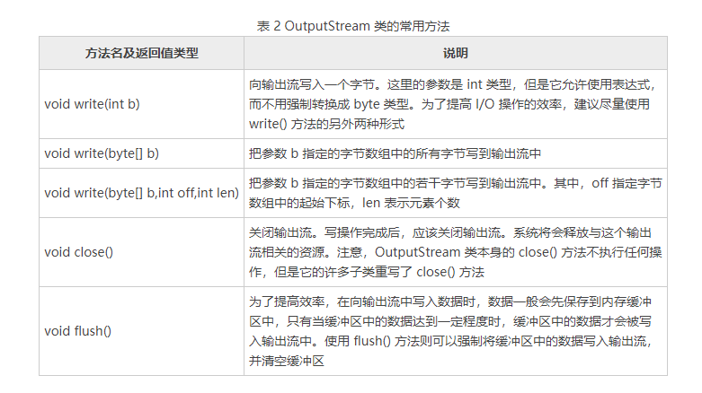
    
        3,字节数组输入流
            ByteArrayInputStream 类可以从内存的字节数组中读取数据，该类有如下两种构造方法重载形式。
                ByteArrayInputStream(byte[] buf)：创建一个字节数组输入流，字节数组类型的数据源由参数 buf 指定。
                ByteArrayInputStream(byte[] buf,int offse,int length)：创建一个字节数组输入流，其中，参数 buf 指定字节数组类型的数据源，offset 指定在数组中开始读取数据的起始下标位置，length 指定读取的元素个数。
        4，字节数组输出流
            ByteArrayOutputStream 类可以向内存的字节数组中写入数据，该类的构造方法有如下两种重载形式。
                ByteArrayOutputStream()：创建一个字节数组输出流，输出流缓冲区的初始容量大小为 32 字节。
                ByteArrayOutputStream(int size)：创建一个字节数组输出流，输出流缓冲区的初始容量大小由参数 size 指定。
                ByteArrayOutputStream 类中除了有前面介绍的字节输出流中的常用方法以外，还有如下两个方法。
                intsize()：返回缓冲区中的当前字节数。
                byte[] toByteArray()：以字节数组的形式返回输出流中的当前内容。
        5，文件输入流
            在创建 FileInputStream 类的对象时，如果找不到指定的文件将拋出 FileNotFoundException 异常，该异常必须捕获或声明拋出。
            FileInputStream 常用的构造方法主要有如下两种重载形式。
                FileInputStream(File file)：通过打开一个到实际文件的连接来创建一个 FileInputStream，该文件通过文件系统中的 File 对象 file 指定。
                FileInputStream(String name)：通过打开一个到实际文件的链接来创建一个 FileInputStream，该文件通过文件系统中的路径名 name 指定。
        6，文件输出流
            FileOutputStream 类继承自 OutputStream 类，重写和实现了父类中的所有方法。FileOutputStream 类的对象表示一个文件字节输出流，可以向流中写入一个字节或一批字节。在创建 FileOutputStream 类的对象时，如果指定的文件不存在，则创建一个新文件；如果文件已存在，则清除原文件的内容重新写入
            FileOutputStream 类的构造方法主要有如下 4 种重载形式。
                FileOutputStream(File file)：创建一个文件输出流，参数 file 指定目标文件。
                FileOutputStream(File file,boolean append)：创建一个文件输出流，参数 file 指定目标文件，append 指定是否将数据添加到目标文件的内容末尾，如果为 true，则在末尾添加；如果为 false，则覆盖原有内容；其默认值为 false。
                FileOutputStream(String name)：创建一个文件输出流，参数 name 指定目标文件的文件路径信息。
                FileOutputStream(String name,boolean append)：创建一个文件输出流，参数 name 和 append 的含义同上。
    5,字符流
        1，字符输入流
            Reader 类是所有字符流输入类的父类，该类定义了许多方法，这些方法对所有子类都是有效的。
            Reader 类的常用子类如下。
                CharArrayReader 类：将字符数组转换为字符输入流，从中读取字符。
                StringReader 类：将字符串转换为字符输入流，从中读取字符。
                BufferedReader 类：为其他字符输入流提供读缓冲区。
                PipedReader 类：连接到一个 PipedWriter。
                InputStreamReader 类：将字节输入流转换为字符输入流，可以指定字符编码。
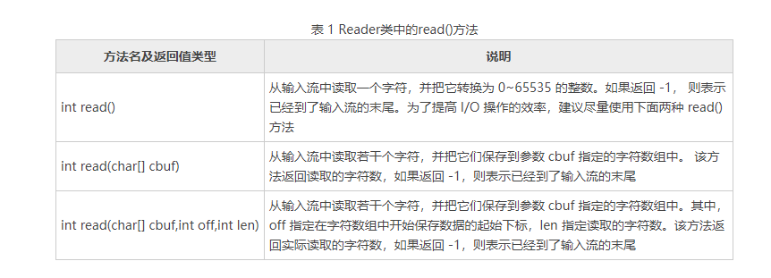

        2,字符输出流
            与 Reader 类相反，Writer 类是所有字符输出流的父类，该类中有许多方法，这些方法对继承该类的所有子类都是有效的。
            Writer 类的常用子类如下。
                CharArrayWriter 类：向内存缓冲区的字符数组写数据。
                StringWriter 类：向内存缓冲区的字符串（StringBuffer）写数据。
                BufferedWriter 类：为其他字符输出流提供写缓冲区。
                PipedWriter 类：连接到一个 PipedReader。
                OutputStreamReader 类：将字节输出流转换为字符输出流，可以指定字符编码。
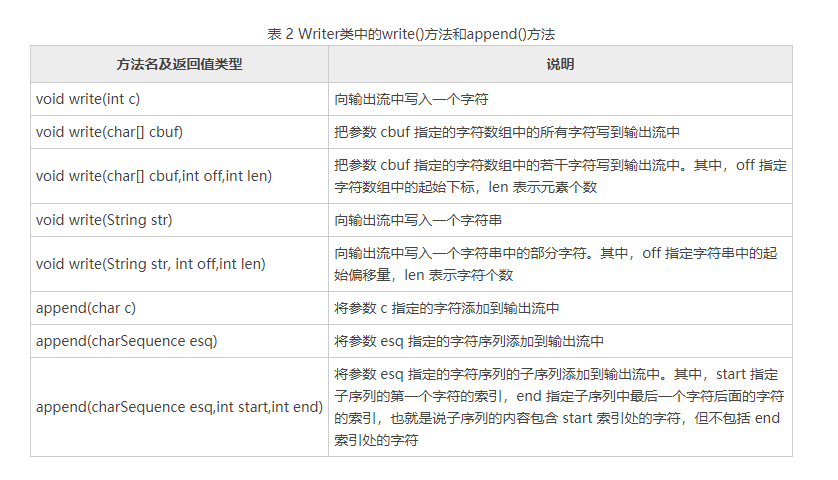

        3,字符文件输入流
            为了读取方便，Java 提供了用来读取字符文件的便捷类——FileReader。该类的构造方法有如下两种重载形式。
                FileReader(File file)：在给定要读取数据的文件的情况下创建一个新的 FileReader 对象。其中，file 表示要从中读取数据的文件。
                FileReader(String fileName)：在给定从中读取数据的文件名的情况下创建一个新 FileReader 对象。其中，fileName 表示要从中读取数据的文件的名称，表示的是一个文件的完整路径。
        4,字符文件输出流
            Java 提供了写入字符文件的便捷类——FileWriter，该类的构造方法有如下 4 种重载形式。
                FileWriter(File file)：在指定 File 对象的情况下构造一个 FileWriter 对象。其中，file 表示要写入数据的 File 对象。
                FileWriter(File file,boolean append)：在指定 File 对象的情况下构造一个 FileWriter 对象，如果 append 的值为 true，则将字节写入文件末尾，而不是写入文件开始处。
                FileWriter(String fileName)：在指定文件名的情况下构造一个 FileWriter 对象。其中，fileName 表示要写入字符的文件名，表示的是完整路径。
                FileWriter(String fileName,boolean append)：在指定文件名以及要写入文件的位置的情况下构造 FileWriter 对象。其中，append 是一个 boolean 值，如果为 true，则将数据写入文件末尾，而不是文件开始处。
        5,字符缓冲区输入流
            BufferedReader 类主要用于辅助其他字符输入流，它带有缓冲区，可以先将一批数据读到内存缓冲区。接下来的读操作就可以直接从缓冲区中获取数据，而不需要每次都从数据源读取数据并进行字符编码转换，这样就可以提高数据的读取效率。
            BufferedReader 类的构造方法有如下两种重载形式。
                BufferedReader(Reader in)：创建一个 BufferedReader 来修饰参数 in 指定的字符输入流。
                BufferedReader(Reader in,int size)：创建一个 BufferedReader 来修饰参数 in 指定的字符输入流，参数 size 则用于指定缓冲区的大小，单位为字符。
            除了可以为字符输入流提供缓冲区以外，BufferedReader 还提供了 readLine() 方法，该方法返回包含该行内容的字符串，但该字符串中不包含任何终止符，如果已到达流末尾，则返回 null。readLine() 方法表示每次读取一行文本内容，当遇到换行（\n）、回车（\r）或回车后直接跟着换行标记符即可认为某行已终止。
        6,字符缓冲区输出流
            BufferedWriter 类主要用于辅助其他字符输出流，它同样带有缓冲区，可以先将一批数据写入缓冲区，当缓冲区满了以后，再将缓冲区的数据一次性写到字符输出流，其目的是为了提高数据的写效率。
            BufferedWriter 类的构造方法有如下两种重载形式。
                BufferedWriter(Writer out)：创建一个 BufferedWriter 来修饰参数 out 指定的字符输出流。
                BufferedWriter(Writer out,int size)：创建一个 BufferedWriter 来修饰参数 out 指定的字符输出流，参数 size 则用于指定缓冲区的大小，单位为字符。
# Spring
# 基础
## 1. spring基本架构
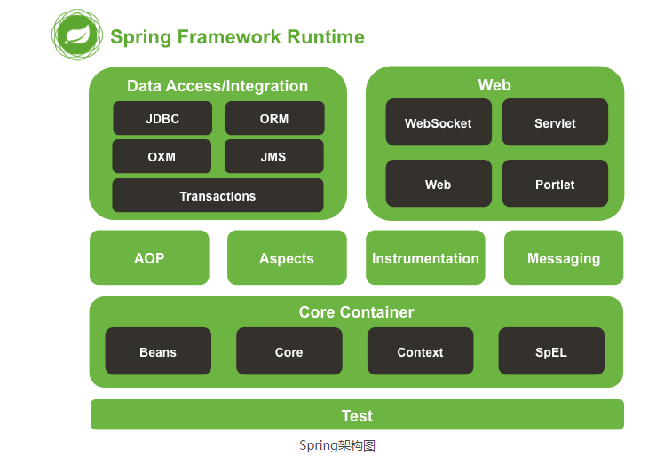
- Data Access/Integration（数据访问／集成）
  - JDBC 模块：提供了一个 JBDC 的样例模板，使用这些模板能消除传统冗长的 JDBC 编码还有必须的事务控制，而且能享受到 Spring 管理事务的好处。  
  - ORM 模块：提供与流行的“对象-关系”映射框架无缝集成的 API，包括 JPA、JDO、Hibernate 和 MyBatis 等。而且还可以使用 Spring 事务管理，无需额外控制事务。  
  - OXM 模块：提供了一个支持 Object /XML 映射的抽象层实现，如 JAXB、Castor、XMLBeans、JiBX 和 XStream。将 Java 对象映射成 XML 数据，或者将XML 数据映射成 Java 对象。  
  - JMS 模块：指 Java 消息服务，提供一套 “消息生产者、消息消费者”模板用于更加简单的使用 JMS，JMS 用于用于在两个应用程序之间，或分布式系统中发送消息，进行异步通信。  
  - Transactions 事务模块：支持编程和声明式事务管理。
- Web模块
  - Web 模块：提供了基本的 Web 开发集成特性，例如多文件上传功能、使用的 Servlet 监听器的 IOC 容器初始化以及 Web 应用上下文。
  - Servlet 模块：提供了一个 Spring MVC Web 框架实现。Spring MVC 框架提供了基于注解的请求资源注入、更简单的数据绑定、数据验证等及一套非常易用的 JSP 标签，完全无缝与 Spring 其他技术协作。
  - WebSocket 模块：提供了简单的接口，用户只要实现响应的接口就可以快速的搭建 WebSocket Server，从而实现双向通讯。
  - Portlet 模块：提供了在 Portlet 环境中使用 MVC 实现，类似 Web-Servlet 模块的功能。
- Core Container（Spring的核心容器）
  - Beans 模块：提供了框架的基础部分，包括控制反转和依赖注入。
  - Core 核心模块：封装了 Spring 框架的底层部分，包括资源访问、类型转换及一些常用工具类。
  - Context 上下文模块：建立在 Core 和 Beans 模块的基础之上，集成 Beans 模块功能并添加资源绑定、数据验证、国际化、Java EE 支持、容器生命周期、事件传播等。ApplicationContext 接口是上下文模块的焦点。
  - SpEL 模块：提供了强大的表达式语言支持，支持访问和修改属性值，方法调用，支持访问及修改数组、容器和索引器，命名变量，支持算数和逻辑运算，支持从 Spring 容器获取 Bean，它也支持列表投影、选择和一般的列表聚合等。
- AOP、Aspects、Instrumentation和Messaging
  - AOP 模块：提供了面向切面编程实现，提供比如日志记录、权限控制、性能统计等通用功能和业务逻辑分离的技术，并且能动态的把这些功能添加到需要的代码中，这样各司其职，降低业务逻辑和通用功能的耦合。
  - Aspects 模块：提供与 AspectJ 的集成，是一个功能强大且成熟的面向切面编程（AOP）框架。
  - Instrumentation 模块：提供了类工具的支持和类加载器的实现，可以在特定的应用服务器中使用。
  - messaging 模块：Spring 4.0 以后新增了消息（Spring-messaging）模块，该模块提供了对消息传递体系结构和协议的支持。
- Test模块
  - Test 模块：Spring 支持 Junit 和 TestNG 测试框架，而且还额外提供了一些基于 Spring 的测试功能，比如在测试 Web 框架时，模拟 Http 请求的功能。

## IOC容器
1. BeanFactory 容器
 - BeanFactory 就是一个管理 Bean 的工厂，它主要负责初始化各种 Bean，并调用它们的生命周期方法。
2. ApplicationContext 容器
- ApplicationContext 继承了 BeanFactory 接口，由 org.springframework.context.ApplicationContext 接口定义，对象在启动容器时加载。ApplicationContext 在 BeanFactory 的基础上增加了很多企业级功能，例如 AOP、国际化、事件支持等。
- ApplicationContext 接口有两个常用的实现类
  - ClassPathXmlApplicationContext
    - 该类从类路径 ClassPath 中寻找指定的 XML 配置文件，并完成 ApplicationContext 的实例化工作，
  - FileSystemXmlApplicationContext
    - 该类从指定的文件系统路径中寻找指定的 XML 配置文件，并完成 ApplicationContext 的实例化工作，
## Bean
1. 由 Spring IoC 容器管理的对象称为 Bean，Bean 根据 Spring 配置文件中的信息创建。


2. 作用域
   1. singleton  
      默认值，单例模式，表示在 Spring 容器中只有一个 Bean 实例，Bean 以单例的方式存在。当 Bean 的作用域为 singleton 时，Spring 容器中只会存在一个共享的 Bean 实例。该 Bean 实例将存储在高速缓存中，并且所有对 Bean 的请求，只要 id 与该 Bean 定义相匹配，都会返回该缓存对象。通常情况下，这种单例模式对于无会话状态的 Bean（如 DAO 层、Service 层）来说，是最理想的选择。
   2. prototype  
      原型模式，表示每次通过 Spring 容器获取 Bean 时，容器都会创建一个 Bean 实例。
   3. request  
      每次 HTTP 请求，容器都会创建一个 Bean 实例。该作用域只在当前 HTTP Request 内有效。
   4. session  
      同一个 HTTP Session 共享一个 Bean 实例，不同的 Session 使用不同的 Bean 实例。该作用域仅在当前 HTTP Session 内有效。
   5. application  
      同一个 Web 应用共享一个 Bean 实例，该作用域在当前 ServletContext 内有效。类似于 singleton，不同的是，singleton 表示每个 IoC 容器中仅有一个 Bean 实例，而同一个 Web 应用中可能会有多个 IoC 容器，但一个 Web 应用只会有一个 ServletContext，也可以说 application 才是 Web 应用中货真价实的单例模式。
      1. websocket  x
         websocket 的作用域是 WebSocket ，即在整个 WebSocket 中有效。
3. 生命周期  
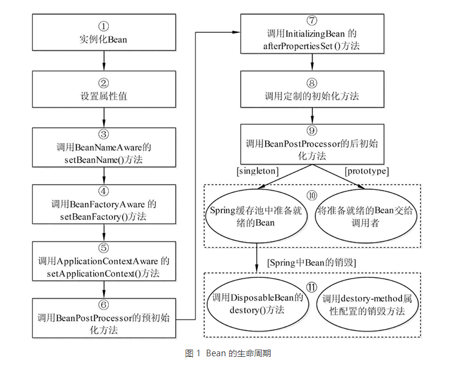
   1. Bean 生命周期的整个执行过程描述如下。
      - Spring 启动，查找并加载需要被 Spring 管理的 Bean，并实例化 Bean。
      - 利用依赖注入完成 Bean 中所有属性值的配置注入。
      - 如果 Bean 实现了 BeanNameAware 接口，则 Spring 调用 Bean 的 setBeanName() 方法传入当前 Bean 的 id 值。
      - 如果 Bean 实现了 BeanFactoryAware 接口，则 Spring 调用 setBeanFactory() 方法传入当前工厂实例的引用。
      - 如果 Bean 实现了 ApplicationContextAware 接口，则 Spring 调用 setApplicationContext() 方法传入当前 ApplicationContext 实例的引用。
      - 如果 Bean 实现了 BeanPostProcessor 接口，则 Spring 调用该接口的预初始化方法 postProcessBeforeInitialzation() 对 Bean 进行加工操作，此处非常重要，Spring 的 AOP 就是利用它实现的。
      - 如果 Bean 实现了 InitializingBean 接口，则 Spring 将调用 afterPropertiesSet() 方法。
      - 如果在配置文件中通过 init-method 属性指定了初始化方法，则调用该初始化方法。
      - 如果 BeanPostProcessor 和 Bean 关联，则 Spring 将调用该接口的初始化方法 postProcessAfterInitialization()。此时，Bean 已经可以被应用系统使用了。
      - 如果在 <bean> 中指定了该 Bean 的作用域为 singleton，则将该 Bean 放入 Spring IoC 的缓存池中，触发 Spring 对该 Bean 的生命周期管理；如果在 <bean> 中指定了该 Bean 的作用域为 prototype，则将该 Bean 交给调用者，调用者管理该 Bean 的生命周期，Spring 不再管理该 Bean。
      - 如果 Bean 实现了 DisposableBean 接口，则 Spring 会调用 destory() 方法销毁 Bean；如果在配置文件中通过 destory-method 属性指定了 Bean 的销毁方法，则 Spring 将调用该方法对 Bean 进行销毁。
      - Spring 为 Bean 提供了细致全面的生命周期过程，实现特定的接口或设置 <bean> 的属性都可以对 Bean 的生命周期过程产生影响。建议不要过多的使用 Bean 实现接口，因为这样会导致代码的耦合性过高。